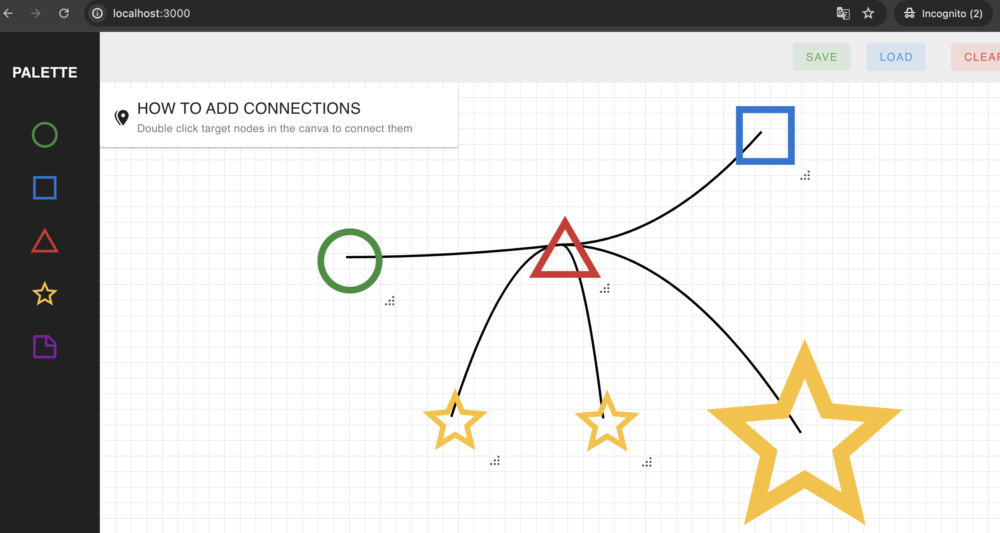

# Nuxt Canvas Project

This project is a Nuxt.js application with a canvas feature where users can drag and drop pre-defined components onto a canvas, resize them, and connect them with curved lines. The state management is handled using Pinia.



## Table of Contents

- [Features](#features)
- [Installation](#installation)
- [Usage](#usage)
- [Project Structure](#project-structure)
- [Components](#components)
- [Store](#store)
- [License](#license)

## Features

- Drag and drop components such as circle, squre, star, note, triangle into a canvas.
- Enable to drag or resize the components.
- Double click the components to connect them with curved lines.
- Save and load canvas state using localStorage.
- Clear the canvas.

## Installation

1. Clone the repository:

```bash
git clone https://github.com/wannamakeudance/nust-canvas.git
```

2. Navigate to the project directory:

```bash
cd nuxt-canvas/
```

3. Make sure node version >= 18

4. Install dependencies:

```bash
yarn install
```

## Usage

1. Start the development server:

```bash
yarn dev
```

2. Open your browser and navigate to `http://localhost:3000`.

## Project Structure

```bash
nuxt-canvas-project
├── components
│   ├── Toolbar.vue
│   ├── Canvas.vue
│   ├── Sidebar.vue
│   └── Node.vue
├── stores
│   └── canvas.js
│── plugins
├── public
├── nuxt.config.js
└── package.json
```

## Components

### Sidebar

`Sidebar.vue` contains a list of draggable items that can be added to the canvas.

### Canvas

`Canvas.vue` handles the main canvas area where users can drag and drop components, resize them, and connect them with lines.

### Node

`Node.vue` represents individual nodes that can be dragged and resized.

### Toolbar

`Toolbar.vue` provides a toolbar with buttons to save, load, and clear the canvas.

## Store

The project uses Pinia for state management. The store is defined in `stores/canvas.js` and handles the state for nodes and connections, including actions for saving, loading, and clearing the canvas.

## License

This project is licensed under the MIT License.
